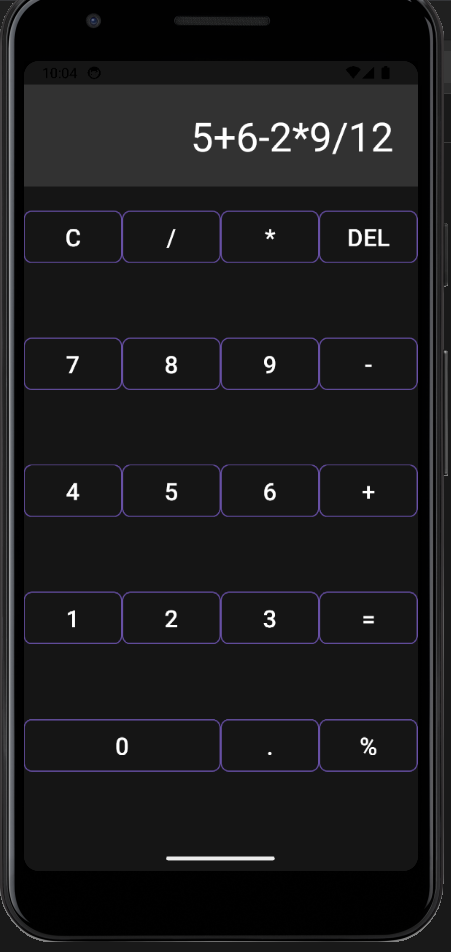

# Android Calculator

## Overview

The Android Calculator is a simple and functional calculator app designed for Android devices. It supports basic arithmetic operations, including addition, subtraction, multiplication, and division, as well as percentage calculations. The app uses Stack \ for evaluating mathematical expressions.

## Features

- Basic arithmetic operations: Addition, Subtraction, Multiplication, Division
- Percentage calculations
- Handling of decimal numbers
- Clear and delete functionalities
- Error handling for invalid inputs and mathematical errors

## Screenshots


<br><br>
<br>



## Requirements

- Android Studio
- Android SDK
- Minimum Android API Level: 21 (Lollipop)

## Installation

1. **Clone the repository:**
   ```bash
   git clone https://github.com/dpshah23/Calculator-Android-App.git
   ```

2. **Open the project in Android Studio:**
   - Launch Android Studio.
   - Select `Open` and navigate to the project directory.
   - Click `OK` to import the project.

3. **Build and Run:**
   - Connect an Android device or start an emulator.
   - Click `Run` in Android Studio or use the command line:
     ```bash
     ./gradlew installDebug
     ```

## Usage

1. **Launch the app** on your Android device.
2. **Enter numbers** using the numeric buttons.
3. **Perform calculations** by selecting the desired operators (`+`, `-`, `*`, `/`, `%`) and then pressing the `=` button to get the result.
4. **Clear the display** with the `C` button or **delete the last character** with the `DEL` button.
5. **Use the dot (.) button** to add decimal points.
